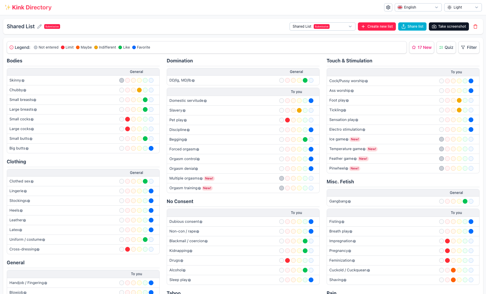
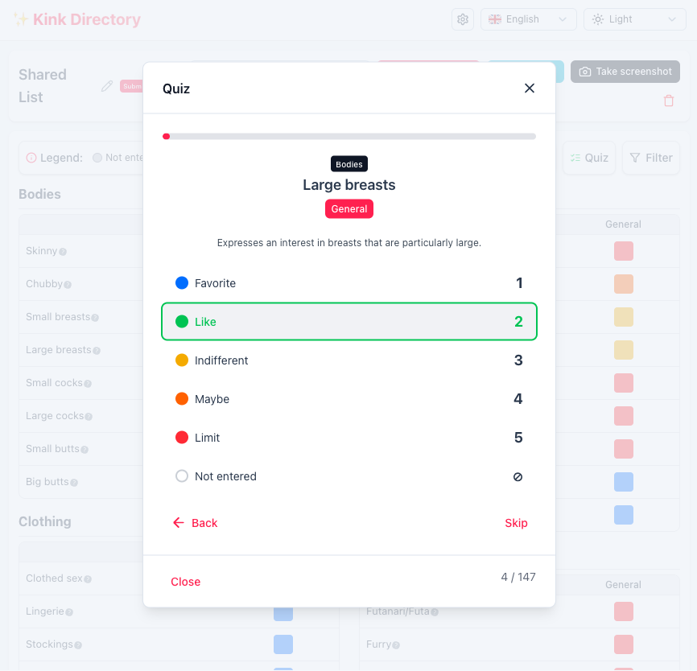
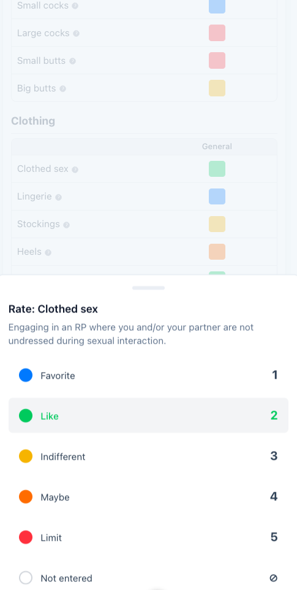

# 📋 Kink Directory

A privacy-focused tool to explore, define, and share your preferences and boundaries.


## ✨ About

Kink Directory helps you create personalized kink lists to explore your preferences and boundaries. Whether you're new to kink or experienced, this tool makes it easy to communicate your interests with partners or keep track of your own journey.

## 🚀 Features

- ✏️ **Create personalized lists** - Explore your preferences and boundaries at your own pace
- 🔒 **Complete privacy** - All data is stored only in your browser, nothing is sent to any server
- 🔗 **Share with partners** - Generate shareable links to send to partners when you want them to see your preferences
- 👤 **Role customization** - Choose your role perspective and customize your list with detailed preferences for each item
- 🎨 **User-friendly interface** - Simple, clean design with intuitive controls
- 🌐 **Multi-language support** - Available in multiple languages to serve a global audience
- 📝 **Quiz mode** - Quickly rate all kinks by going through them one by one in a guided interface

## 🌍 Supported Languages

- English
- Nederlands (Dutch)
- Español (Spanish)
- Français (French)
- Deutsch (German)
- Italiano (Italian)
- Português (Portuguese)
- Русский (Russian)
- 中文 (Chinese)
- 日本語 (Japanese)
- 한국어 (Korean)
- العربية (Arabic)
- हिन्दी (Hindi)

## 🛡️ Privacy First

Your privacy is our top priority:

- 💻 **100% browser-based** - All data stays on your device
- 🙅 **No accounts needed** - No sign-up, no personal information collected
- 🚫 **No tracking** - No analytics or cookies that follow you around
- 📖 **Open source** - Code is transparent and available for review

## 🔄 How It Works

1. ✨ Create a new list
2. ✅ Customize your preferences for each item
3. 💾 Save your list (stored locally in your browser)
4. 📤 Optionally generate a shareable link for partners
5. 🔄 Update or modify your list anytime

## 🏁 Getting Started

Simply click "Create new list" to begin exploring your preferences! 🎉

## 📱 Screenshots

### Create a New List


### Customizing Your List


### Quiz Mode


### Mobile Experience


## 🔮 Upcoming Features

We're constantly working to improve Kink Directory. Here are some features we're planning to implement:

- 📸 **Enhanced screenshots** - Better screenshot functionality with more options
- 🔍 **More kinks** - Expanding our list of kinks and preferences for a more comprehensive experience

# Releasing

This project uses Git tags to trigger releases. When you create and push a tag, a GitHub Action will automatically build the project and create a release.

## Creating a Release

To create a new release:

1. Make sure your changes are committed and pushed to the repository
2. Create a new tag with the desired version:
   ```bash
   git tag v1.0.3
   ```
3. Push the tag to GitHub:
   ```bash
   git push origin v1.0.3
   ```
4. The GitHub Action will automatically:
   - Build the project
   - Create a GitHub Release with the built files
   - Upload the dist folder as release assets

## Semantic Versioning

When choosing a version number, follow [Semantic Versioning](https://semver.org/) principles:

- **Patch releases** (1.0.x): Bug fixes and minor changes that don't affect compatibility
- **Minor releases** (1.x.0): New features that don't break existing functionality
- **Major releases** (x.0.0): Breaking changes that require updates to consumer code

## Manual Release Process

If you want to use release-it to handle versioning, changelog updates, and tagging:

```bash
# First, install dependencies
yarn install

# Then run release-it with the desired bump
yarn release patch   # Bump patch version (1.0.x)
yarn release minor   # Bump minor version (1.x.0)
yarn release major   # Bump major version (x.0.0)
```

This will:
1. Update the version in package.json
2. Create a git tag
3. Push changes and tag to GitHub
